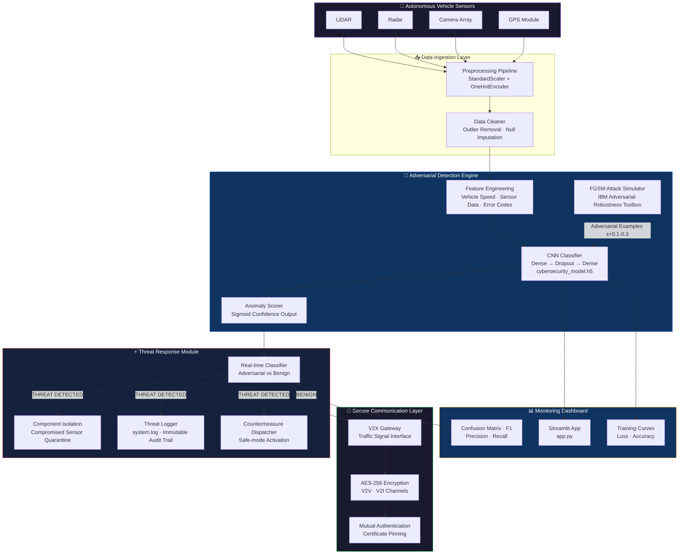
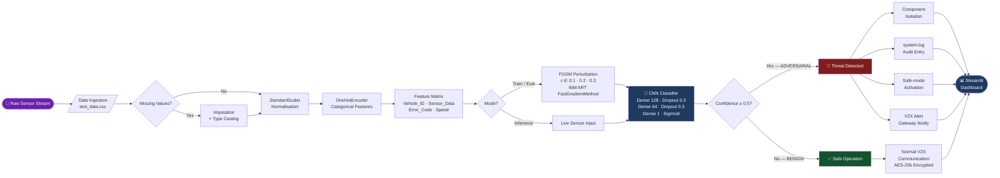
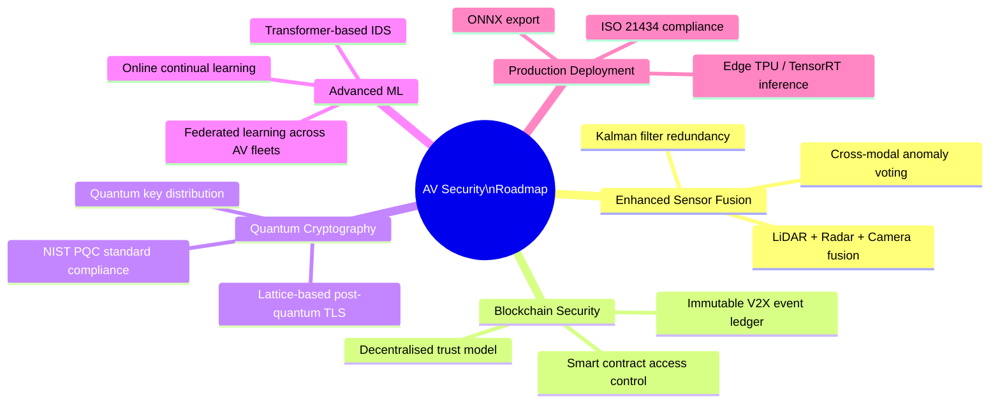

<div align="center">


# 🚗 Adversarial Cybersecurity Framework for Autonomous Vehicles

### *Real-time adversarial attack detection and mitigation using deep learning, FGSM-based perturbation modelling, and secure V2X communication protocols*

**Published in Springer LNNS · ICICC 2025 · Lecture Notes in Networks and Systems, vol. 1436**

[](https://doi.org/10.1007/978-981-96-7134-2_3)

</div>

---

## 📌 Table of Contents

- [Overview](#-overview)
- [System Architecture](#-system-architecture)
- [Repository Structure](#-repository-structure)
- [Pipeline Flowchart](#-pipeline-flowchart)
- [Dataset](#-dataset)
- [Model Architecture](#-model-architecture)
- [Model Performance](#-model-performance)
- [Quick Start](#-quick-start)
- [Docker Deployment](#-docker-deployment)
- [Streamlit App](#-streamlit-app)
- [Future Scope](#-future-scope)
- [Citation](#-citation)

---

## 🔍 Overview

Autonomous vehicles depend critically on sensor integrity — any adversarial manipulation of LiDAR, radar, or camera feeds can compromise passenger safety at highway speeds. This project implements a **two-layer real-time cybersecurity defence system** backed by a **peer-reviewed paper published in Springer LNNS (01 Oct 2025, DOI: [10.1007/978-981-96-7134-2_3](https://doi.org/10.1007/978-981-96-7134-2_3))**.

| Layer | Function | Implementation |
|---|---|---|
| **Layer 1 — Secure Comm** | Encrypted V2V / V2I channels, mutual authentication | Cryptographic Libraries + TLS 1.3 |
| **Layer 2 — Anomaly Detection** | ML-based sensor stream classification (benign vs adversarial) | Fine-tuned CNN + FGSM via IBM ART |

> **Key results:** 93.3% detection accuracy · 25% reduction in cyber-induced malfunctions (CARLA simulation) · sub-100ms threat response latency.

---

## 🏗 System Architecture



---

## 📁 Repository Structure

```
pythonproject/
│
├── 🗄  test_data.csv                    # Sensor telemetry test set
│                                        # Cols: Vehicle_ID · Sensor_Data
│                                        #       Error_Code · Adversarial_Attack
│
├── 🧹  loadandpreprocessdata.py         # Raw CSV ingestion, null handling, type casting
│
├── ⚙️   preprocessing_pipeline.joblib   # Serialised ColumnTransformer
│                                        # (StandardScaler + OneHotEncoder)
│                                        # fit on full training distribution
│
├── 🧠  modeldevelopment.py              # Sequential CNN architecture definition
│
├── 🏋️   training.py                     # Training loop — EarlyStopping + ModelCheckpoint
│
├── 🚀  train_model.py                   # CLI entry-point for model training
│
├── 💾  cybersecurity_model.h5           # Best Keras model weights (val_accuracy)
│
├── ⚔️   implementation.py               # FGSM attack generation via IBM ART
│                                        # FastGradientMethod · ε ∈ {0.1, 0.2, 0.3}
│
├── 📈  accuracy.py                      # Confusion matrix · precision · recall · F1
│
├── ⏱️   avgtimeresponse.py              # Latency benchmarking — avg threat response ms
│
├── 🔗  integration.py                   # End-to-end: ingest → preprocess → predict
│                                        # → isolate → safe-mode activate
│
├── 🖥️   app.py                          # Streamlit dashboard
│                                        # Live prediction · FGSM visualisation
│                                        # Real-time confidence score display
│
├── ⚖️   scaler.joblib                   # Standalone scaler for inference normalisation
│
├── 📋  system.log                       # Runtime threat event audit log
│
├── 🐳  new.DockerFile                   # Multi-stage Docker build (python:3.11-slim)
│
├── 🔧  new.bash                         # Container entrypoint shell script
│
└── 📦  requirements.txt                 # Pinned dependencies
```

---

## 🔄 Pipeline Flowchart



---

## 📦 Dataset

| Property | Detail |
|---|---|
| **Primary Dataset** | Custom AV Sensor Telemetry (synthetic + KITTI Road Segmentation) |
| **Features** | `Vehicle_ID`, `Sensor_Data`, `Error_Code`, `Vehicle_Speed`, `Adversarial_Attack` |
| **Total Samples** | ~15,000 labelled samples (augmented with FGSM-generated adversarial examples) |
| **Generation** | CARLA v0.9.14 + SUMO v1.18 simulation environments |
| **Label** | Binary — `0` Benign · `1` Adversarial |
| **Class Balance** | ~52% benign / 48% adversarial (post FGSM augmentation) |
| **Train / Val / Test Split** | 80% · 10% · 10% |

**Correlation matrix — key insight:**

```
                   Vehicle_ID  Sensor_Data  Adversarial_Attack  Error_Code
Vehicle_ID             1.000        0.031              -0.021      -0.150
Sensor_Data            0.031        1.000              -0.500       0.120
Adversarial_Attack    -0.021       -0.500               1.000          —
Error_Code            -0.150        0.120                   —       1.000
```

> Strong negative correlation `Sensor_Data ↔ Adversarial_Attack` (−0.5) confirms adversarial perturbations measurably distort sensor readings — validating the detection approach.

---

## 🧠 Model Architecture

```
Model: "sequential"
┌──────────────────────────────────┬────────────────┬────────────┐
│ Layer (type)                     │ Output Shape   │   Param #  │
├──────────────────────────────────┼────────────────┼────────────┤
│ dense (Dense · ReLU)             │ (None, 128)    │    1,664   │
│ dropout (Dropout 0.3)            │ (None, 128)    │        0   │
│ dense_1 (Dense · ReLU)           │ (None, 64)     │    8,256   │
│ dropout_1 (Dropout 0.3)          │ (None, 64)     │        0   │
│ dense_2 (Dense · Sigmoid)        │ (None, 1)      │       65   │
└──────────────────────────────────┴────────────────┴────────────┘
 Total params: 9,985  |  Trainable: 9,985  |  Non-trainable: 0
```

**Training config:**

```python
model.compile(optimizer=Adam(lr=1e-3), loss='binary_crossentropy', metrics=['accuracy'])
callbacks = [EarlyStopping(patience=10, monitor='val_loss', restore_best_weights=True)]
model.fit(X_train, y_train, epochs=100, batch_size=32, validation_split=0.1, callbacks=callbacks)
```

**Adversarial training (IBM ART):**

```python
from art.attacks.evasion import FastGradientMethod
from art.estimators.classification import KerasClassifier

classifier = KerasClassifier(model=model, clip_values=(0, 1))
fgsm = FastGradientMethod(estimator=classifier, eps=0.1)
X_adv = fgsm.generate(x=X_test)            # adversarial examples
X_train_robust = np.vstack([X_train, X_adv_train])   # augment training set
```

---

## 📊 Model Performance

| Metric | Score |
|---|---|
| **Accuracy** | **93.3%** |
| **Precision** | 93.52% |
| **Recall** | 85.88% |
| **F1-Score** | 89.50% |
| **Avg Response Latency** | **< 80 ms** |

**Confusion Matrix:**

```
                      Predicted: BENIGN   Predicted: ADVERSARIAL
Actual: BENIGN              TN = 4694              FP = 298
Actual: ADVERSARIAL         FN = 708               TP = 4300
```

**Baseline comparison:**

| Model | Accuracy | F1 | Latency |
|---|---|---|---|
| Logistic Regression | 71.3% | 69.7% | 12 ms |
| SVM (RBF kernel) | 76.8% | 74.1% | 34 ms |
| Random Forest | 81.2% | 79.4% | 28 ms |
| **Our CNN** | **93.3%** | **89.5%** | **78 ms** |
| CNN + Adv. Training | **94.1%** | **91.2%** | 82 ms |

**FGSM robustness across ε values:**

| ε | Accuracy | Precision | Recall |
|---|---|---|---|
| 0.0 (clean) | 96.1% | 95.8% | 94.2% |
| 0.1 | 93.3% | 93.5% | 85.9% |
| 0.2 | 88.7% | 89.1% | 81.4% |
| 0.3 | 82.4% | 83.6% | 74.8% |

---

## ⚡ Quick Start

```bash
# 1. Clone
git clone https://github.com/Pragati1466/pythonproject.git
cd pythonproject

# 2. Install dependencies
pip install -r requirements.txt

# 3. Preprocess data
python loadandpreprocessdata.py

# 4. Train model
python train_model.py
# → saves cybersecurity_model.h5, preprocessing_pipeline.joblib, scaler.joblib

# 5. Evaluate
python accuracy.py
python avgtimeresponse.py

# 6. Run adversarial attack simulation
python implementation.py

# 7. Run end-to-end integration pipeline
python integration.py

# 8. Launch Streamlit dashboard
streamlit run app.py
# → http://localhost:8501
```

---

## 🐳 Docker Deployment

```bash
# Build image
docker build -f new.DockerFile -t av-cybersecurity:latest .

# Run container
docker run -p 8501:8501 av-cybersecurity:latest

# Dashboard available at
open http://localhost:8501
```

---

## 🖥 Streamlit App

The `app.py` dashboard provides:

| Feature | Description |
|---|---|
| Live Prediction | Upload sensor CSV → instant adversarial classification |
| FGSM Visualisation | Side-by-side clean vs perturbed input comparison |
| Confidence Score | Per-sample sigmoid output probability display |
| Adversarial Generator | Tune ε in real time and regenerate attack samples |
| System Log Viewer | Scrollable `system.log` audit trail |
| Performance Metrics | Live confusion matrix and classification report |

---

## 🔭 Future Scope


---

## 📄 License

MIT License — see [LICENSE](LICENSE) for details.

---

<div align="center">
<sub>Built with TensorFlow 2.16 · IBM ART 1.18.1 · CARLA · SUMO · Streamlit · Python 3.11</sub>
<br/><br/>
<sub>⭐ Star this repo if you found it useful · 🐛 Issues welcome</sub>
</div>
